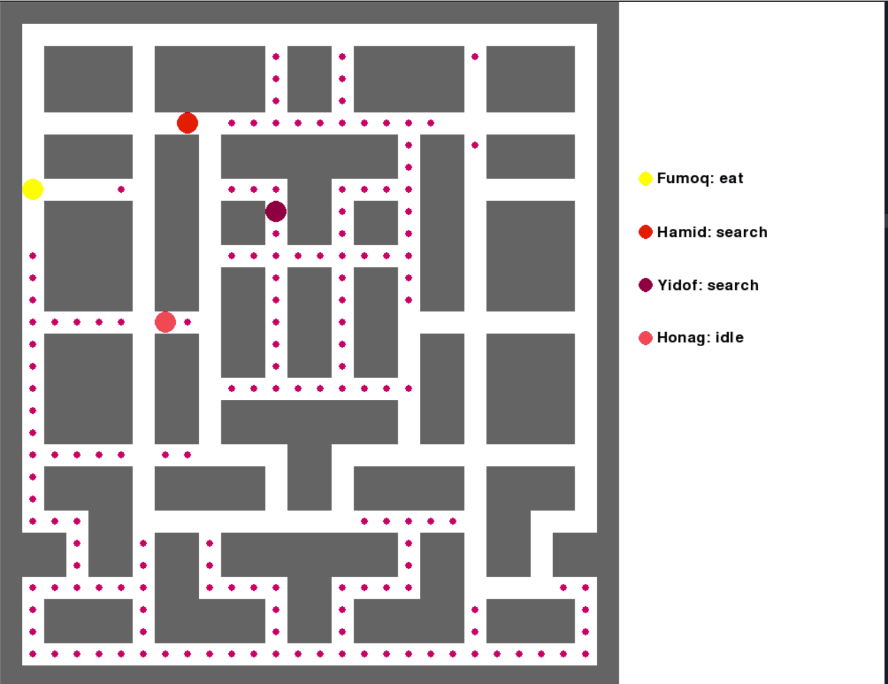
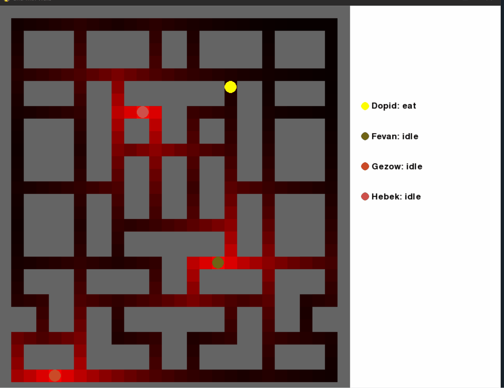

# Grid-Based Predator–Prey Simulation (Pygame)

This project is a **grid-based simulation game built with Pygame** that models interactions between one **Eater** agent and multiple **Seeker** agents on a tiled environment. Agents navigate the map using **A\*** pathfinding while responding to dynamic threat levels and state-based behaviors.

---

## Overview

- **Eater**
  - Objective: consume all pellets on the grid.
  - Uses **A\*** to search for pellets.

- **Seekers**
  - Objective: catch the Eater.
  - Use **A\*** to pursue the Eater.
  - Alternates between **search** and **idle** states.

- **Environment**
  - Grid-based map with walkable and unwalkable tiles.
  - Pellets distributed across walkable tiles.
  - A dynamic **threat graph** that decays over time and influences pathfinding.

---

## Features

- A\* pathfinding for all agents  
- State-based agent behavior (idle, search, eat.)  
- Threat heatmap system with decay  
- Configurable environment via YAML  
- Optional debug overlay for threat visualization  
- Information panel displaying agent states  

---

## Controls & Gameplay

- The simulation runs automatically once started.
- The game ends when:
  - **Eater wins**: all pellets are consumed.
  - **Seekers win**: any seeker reaches the eater’s position.

## Gameplay Preview

Below are example recordings of the simulation in action. These GIFs demonstrate normal gameplay and the internal threat model used by the agents.

### Normal Gameplay

**Description:**  
The standard view of the simulation.  
- The eater navigates the grid using A\* to locate and consume pellets.  
- Seekers patrol and chase the eater based on their current state.  

**GIF Placeholder:**  

---

### Threat Level Visualization (Debug Mode)

**Description:**  
The same simulation with **threat levels enabled**.  
- Red overlays represent the threat intensity of each tile.  
- Threat values are influenced by seeker positions and decay based on decay factor YAML.  
- The eater uses this information to avoid high-risk paths.

**GIF Placeholder:**  

---